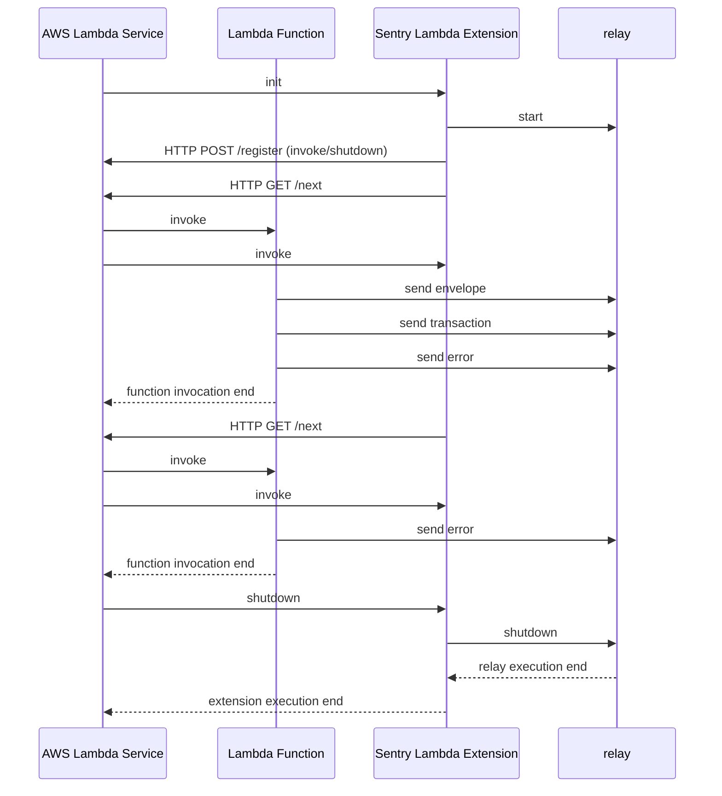

<p align="center">
  <a href="https://sentry.io/?utm_source=github&utm_medium=logo" target="_blank">
    <picture>
      <source srcset="https://sentry-brand.storage.googleapis.com/sentry-logo-white.png" media="(prefers-color-scheme: dark)" />
      <source srcset="https://sentry-brand.storage.googleapis.com/sentry-logo-black.png" media="(prefers-color-scheme: light), (prefers-color-scheme: no-preference)" />
      
    </picture>
  </a>
</p>

_Bad software is everywhere, and we're tired of it. Sentry is on a mission to help developers write better software faster, so we can get back to enjoying technology. If you want to join us [<kbd>**Check out our open positions**</kbd>](https://sentry.io/careers/)_

# Sentry AWS Lambda Extension

AWS Lambda Extension for instrumenting Lambda functions.

## Local development

The extension is a simple Rust project that wraps around Sentry's [relay](https://github.com/getsentry/relay) and is shipped as a binary.

An AWS extension has to talk to the [AWS Lambda Extensions API](https://docs.aws.amazon.com/lambda/latest/dg/runtimes-extensions-api.html). For local development we have to mock this API so we can develop our extension locally. See [Mocking the AWS Lambda environment](#mocking-the-aws-lambda-environment) below.

## Mocking the AWS Lambda environment

### Prerequisites

- Make sure you set the AWS environment variable to localhost port 5000:

  ```bash
  export AWS_LAMBDA_RUNTIME_API=localhost:5000
  ```

  (You can also use https://direnv.net/ for setting environment variables.)

- Make sure you have a Python 3 version installed and running on your machine.

### Running the Mock AWS extensions API

Then open a terminal and start our little server, that mocks the AWS Lambda API being run on localhost:5000:

```bash
cd mock-aws-lambda-extensions-api
./run.sh
```

The `run.sh` will

- create a Python virtual environment
- install necessary Python libraries
- start the mock API on [http://localhost:5000](http://localhost:5000)

## Getting help/support

If you need help setting up or configuring the Python SDK (or anything else in the Sentry universe) please head over to the [Sentry Community on Discord](https://discord.com/invite/Ww9hbqr). There is a ton of great people in our Discord community ready to help you!

## How the Sentry Lambda extension works



## Resources

- [](https://docs.sentry.io/quickstart/)
- [](https://discord.gg/Ww9hbqr)
- [](http://stackoverflow.com/questions/tagged/sentry)
- [](https://twitter.com/intent/follow?screen_name=getsentry)

## License

Licensed under the BSD license, see [`LICENSE`](LICENSE)
